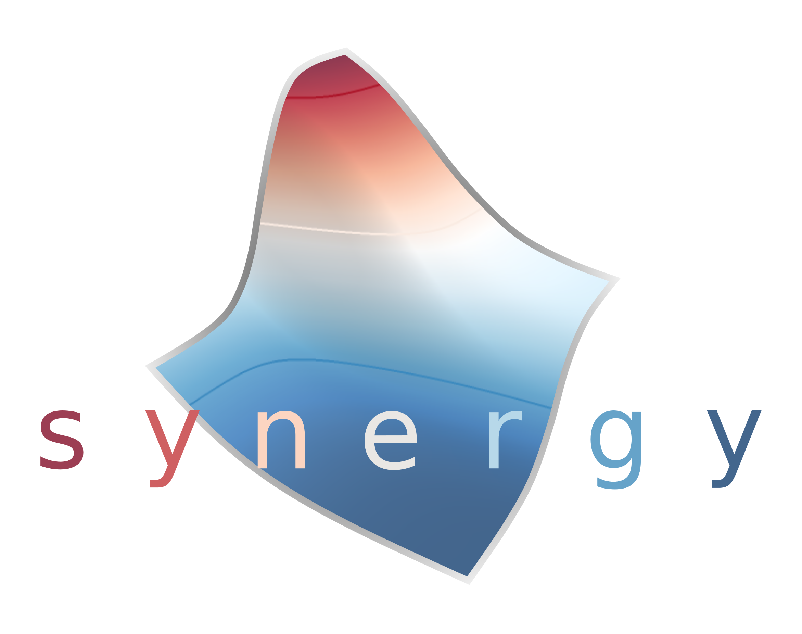

# synergy

A python package to calculate, analyze, and visualize drug combination synergy and antagonism. Currently supports multiple models of synergy, inclding MuSyC, Bliss, Loewe, Combination Index, ZIP, Zimmer, Schindler, and HSA.

Note, this package was not used to calculate MuSyC or others' synergy in "Quantifying Drug Combination Synergy along Potency and Efficacy Axes" (https://doi.org/10.1016/j.cels.2019.01.003), nor "A Consensus Framework Unifies Multi-Drug Synergy Metrics" (https://doi.org/10.1101/683433). It is a standalone implementation.

## Installation

Using PIP
`not yet`

Using conda
`not yet`

Using git
`git clone ...`

## Requirements
* python 3
* numpy
* scipy
* Optional for full plotting functionality
  * matplotlib
  * plotly
  * pandas

## Current features
* Calculate two-drug synergy using
  * Parametric
    * MuSyC
    * Zimmer (effective dose model)
  * Dose-dependent
    * Bliss
    * Loewe
    * Schindler
    * ZIP
    * HSA
    * Combination Index
* Single drug models
  * Four-parameter Hill equation
  * Two-parameter Hill equation
  * Median-effect equation
  * Piecewise linear
* Model scoring
  * R-squared
  * Akaike Information Criterion
  * Bayesian Information Criterion
* Visualization
  * Heatmaps
  * 3D Plotly Surfaces
* Synthetic data tools
  * Drug dilutions using grid-based sampling
  * "Sham experiment" simulation

## Planned features
* Additional models
  * Parametric
    * GPDI
    * BRAID
* Three+ drug combinations (when possible)
* Visualization
  * Highlight single-drug curves on 3D surface plots
  * matplotlib 3D surface plotting
  * Contour plots for heatmaps
  * Isobolgrams
* Additional dose / experiment design tools
  * Alternative dosing strategies
* Monte carlo sampling to obtain confidence intervals for parameters
* Parallelization API for fitting high-throughput screen data

## Current version
0.0.1

## License
GNU General Public License v3 or later (GPLv3+)
