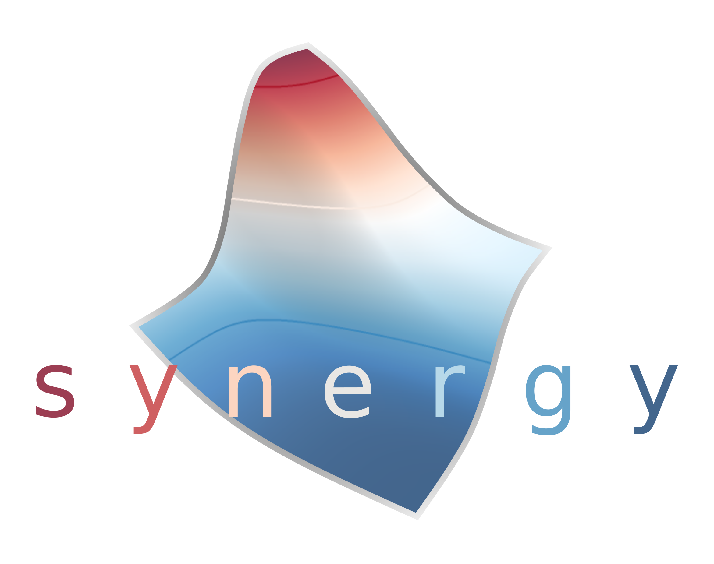

synergy
=======

:code:`synergy` is a python package to calculate, analyze, and visualize drug responses and drug combination synergy and antagonism.

If you use this software, please cite

.. code-block:: none

   Wooten, David J., and Réka Albert. "synergy: a Python library for calculating, analyzing and visualizing drug combination synergy." Bioinformatics 37.10 (2021): 1473-1474.

as well as the original research for any synergy models you use.

.. toctree::
   :maxdepth: 1
   :hidden:
   :caption: Getting started

   installation
   overview

.. toctree::
   :maxdepth: 3
   :hidden:
   :caption: Models
   
   models/single_drugs
   models/synergy_models

.. toctree::
   :hidden:
   :caption: Development

   CHANGELOG
   CONTRIBUTING
   License <https://raw.githubusercontent.com/djwooten/synergy/main/LICENSE>
   GitHub Repository <https://github.com/djwooten/synergy>