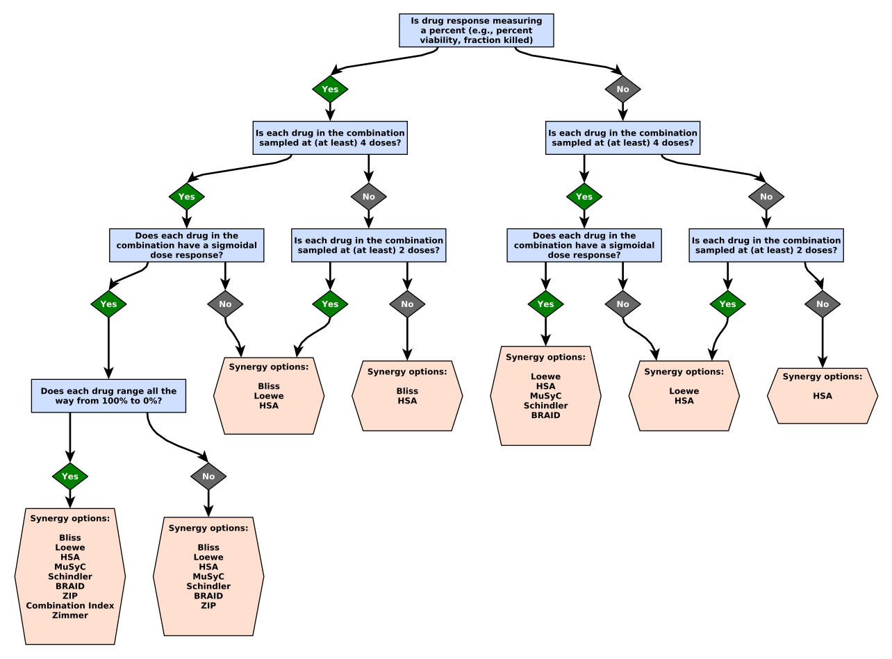

Overview
========

`synergy` can be used to fit dose-response data to single-drug or drug-combination datasets, as well as visualize the results. Detailed examples are given for each supported model below.

## Supported models

### Single-drug

- [Log-linear](models/single/log_linear)
- [Hill](models/single/hill)

### Synergy

- [MuSyC](models/synergy/musyc_notebook)
- Bliss
- Loewe
- Combination Index
- ZIP
- Zimmer
- BRAID
- Schindler
- HSA

## Choosing a model

In general you should understand the assumptions, limitations, and interpretation of any synergy model you use. Here is a quick guide that can get you started:

